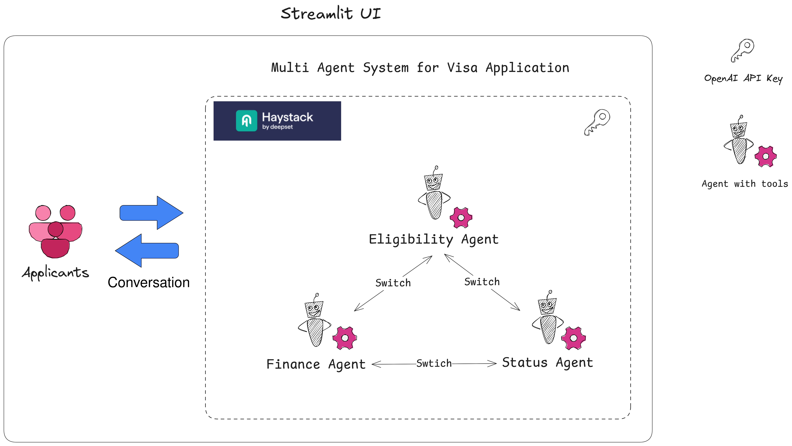

## multi-agent-system

A multi-agent system powered by large language models (LLMs), where each agent is equipped with domain-specific tools and designed to communicate and collaborate with others to collectively address a visa-related issue faced by a simulated applicant.

### Usage

Launch the Streamlit app using the command below, and start by asking a question—such as checking the status of your visa:

```bash
cd src/multi_agent_system/systems/visa_application
poetry run streamlit run app.py
```

Due to current instruction constraints on the agents, your questions must fall within one of the following categories:

* Checking the status of an application
* Cancelling an application
* Fees for different types of visas
* Required documents for a visa application

> [!NOTE]
> The system is designed to be easily extensible and can be expanded to support additional query types as needed.


